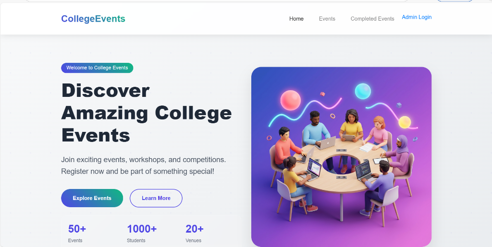
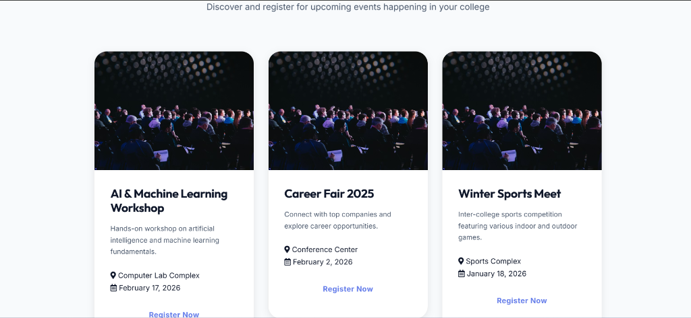
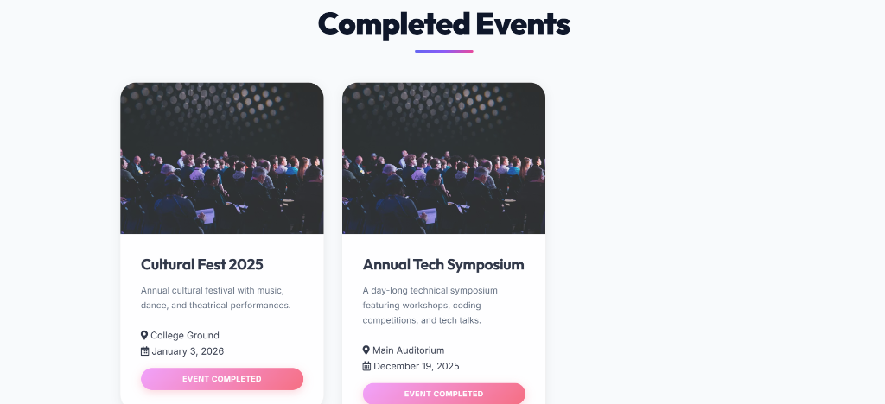
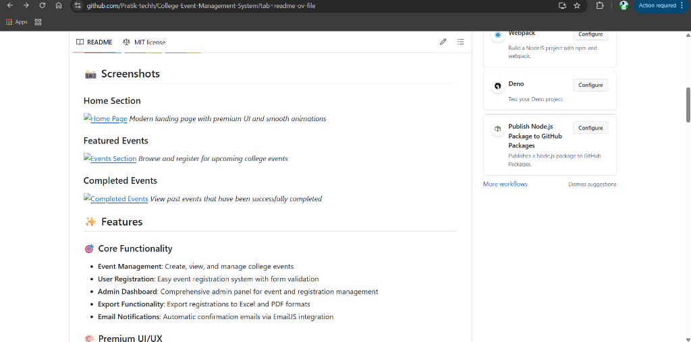

# 🎓 College Event Management System

A modern, feature-rich web application for managing college events built with Django and premium UI design.


## 📸 Screenshots

### Home Section

*Modern landing page with premium UI and smooth animations*

### Featured Events

*Browse and register for upcoming college events*

### Completed Events

*View past events that have been successfully completed*

### Admin Panel

*Comprehensive admin dashboard for managing events, registrations, and ticket scanning*

## ✨ Features

### 🎯 Core Functionality
- **Event Management**: Create, view, and manage college events
- **User Registration**: Easy event registration system with form validation
- **Admin Dashboard**: Comprehensive admin panel for event and registration management
- **Export Functionality**: Export registrations to Excel and PDF formats
- **Email Notifications**: Automatic confirmation emails via EmailJS integration

### 🎨 Premium UI/UX
- Modern, responsive design with glassmorphism effects
- Smooth animations and transitions
- Interactive hover effects
- Mobile-friendly interface
- Premium gradient color schemes
- 3D illustrations and modern iconography

### 📊 Admin Features
- Event CRUD operations
- Registration management
- Event statistics dashboard
- Export registrations (Excel/PDF)
- Filter events by status (upcoming/completed)

## 🛠️ Tech Stack

- **Backend**: Django 5.1
- **Database**: SQLite (development)
- **Frontend**: HTML5, CSS3, JavaScript (Vanilla)
- **Email Service**: EmailJS
- **Export Libraries**: openpyxl, reportlab
- **UI**: Custom CSS with modern design principles

## 📋 Prerequisites

- Python 3.8 or higher
- pip (Python package manager)
- Virtual environment (recommended)

## 🚀 Quick Start

### 1. Clone the Repository
```bash
git clone https://github.com/Pratik-techh/College-Event-Management-System.git
cd College-Event-Management-System
```

### 2. Create Virtual Environment
```bash
python -m venv venv
```

**Activate virtual environment:**
- Windows: `venv\Scripts\activate`
- Mac/Linux: `source venv/bin/activate`

### 3. Install Dependencies
```bash
pip install -r requirements.txt
```

### 4. Database Setup
```bash
cd college_events
python manage.py migrate
```

### 5. Create Admin User
```bash
python manage.py createsuperuser
```

### 6. Collect Static Files
```bash
python manage.py collectstatic
```

### 7. Run Development Server
```bash
python manage.py runserver
```

Visit: **http://127.0.0.1:8000/**

## 📖 Usage

### User Features
1. **Browse Events**: View all upcoming and completed events on the homepage
2. **Register for Events**: Click "Register Now" and fill out the registration form
3. **Event Details**: View event descriptions, dates, locations, and organizers

### Admin Features
1. Access admin panel at: **http://127.0.0.1:8000/admin/**
2. Login with superuser credentials
3. Manage events and registrations
4. Export registration data
5. View event statistics

## 📁 Project Structure

```
College-Event-Management-System/
├── college_events/          # Main Django project
│   ├── events/             # Events app
│   │   ├── models.py       # Database models
│   │   ├── views.py        # View logic
│   │   ├── admin.py        # Admin configuration
│   │   └── urls.py         # URL routing
│   ├── static/             # Static files
│   │   └── events/
│   │       ├── styles.css  # Custom styles
│   │       ├── script.js   # JavaScript logic
│   │       └── images/     # Image assets
│   ├── templates/          # HTML templates
│   └── manage.py          # Django management script
├── .gitignore             # Git ignore file
├── requirements.txt       # Python dependencies
├── SETUP.md              # Detailed setup guide
├── HOW_TO_RUN.md         # Running instructions
└── README.md             # This file
```

## 🔧 Configuration

### EmailJS Setup
1. Create account at [EmailJS](https://www.emailjs.com/)
2. Get your Service ID, Template ID, and Public Key
3. Update in `static/events/script.js`:
```javascript
const SERVICE_ID = 'your_service_id';
const TEMPLATE_ID = 'your_template_id';
const PUBLIC_KEY = 'your_public_key';
```

## 📚 Documentation

- **Setup Guide**: See [SETUP.md](SETUP.md)
- **How to Run**: See [HOW_TO_RUN.md](HOW_TO_RUN.md)
- **Quick Reference**: See [QUICK_REFERENCE.md](QUICK_REFERENCE.md)

## 🤝 Contributing

Contributions are welcome! Please feel free to submit a Pull Request.

1. Fork the repository
2. Create your feature branch (`git checkout -b feature/AmazingFeature`)
3. Commit your changes (`git commit -m 'Add some AmazingFeature'`)
4. Push to the branch (`git push origin feature/AmazingFeature`)
5. Open a Pull Request

## 📝 License

This project is licensed under the MIT License - see the LICENSE file for details.

## 👤 Author

Pratik-techh - [GitHub Profile](https://github.com/Pratik-techh)

## 🙏 Acknowledgments

- Django Documentation
- Modern UI/UX Design Principles
- EmailJS for email service
- Premium illustrations and design assets

## 📧 Contact

For any queries or suggestions, please open an issue or contact at: pratikmandolikar12@gmail.com

---

⭐ **Star this repository if you find it helpful!**
